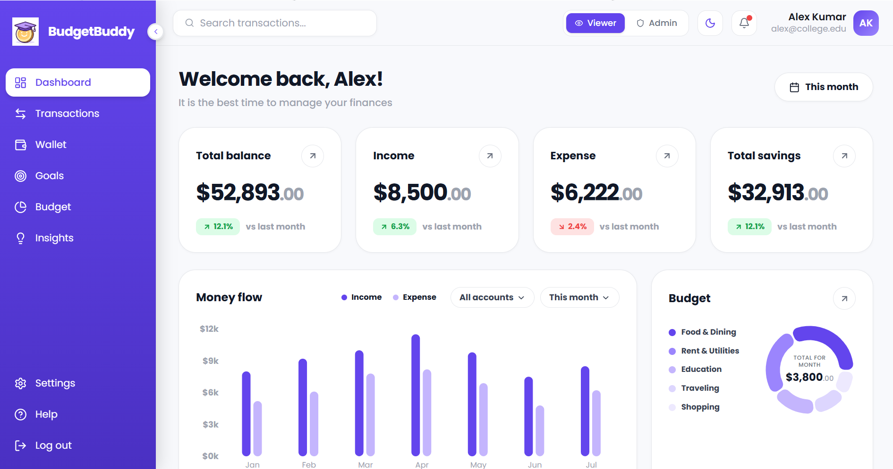
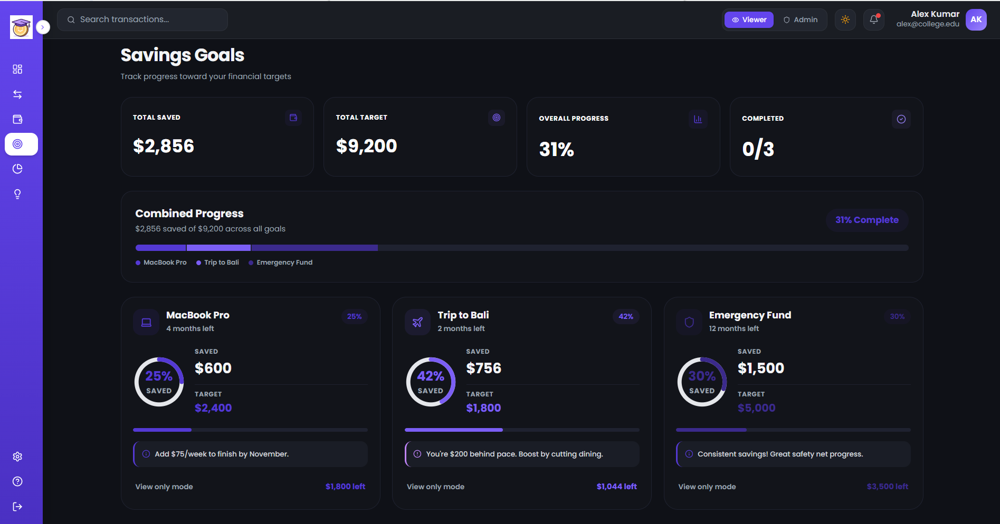
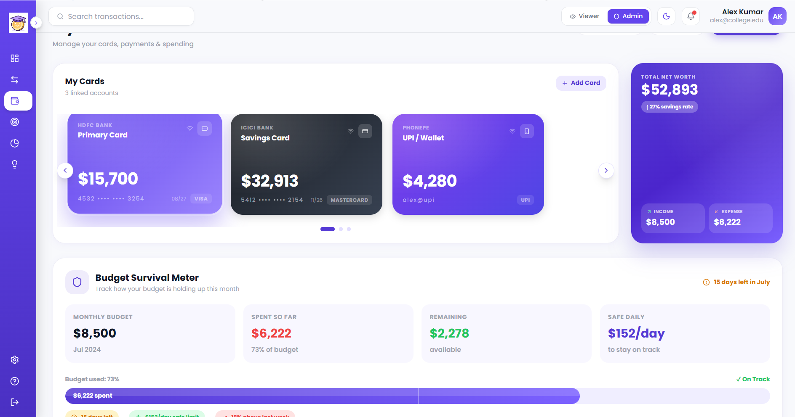
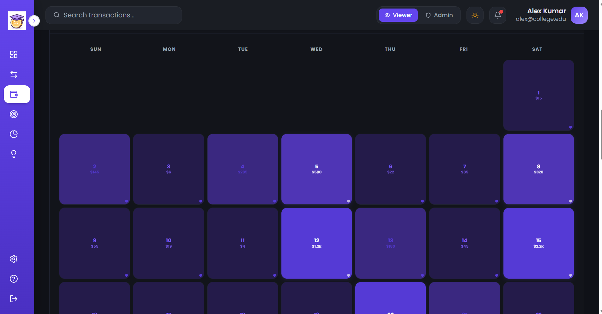
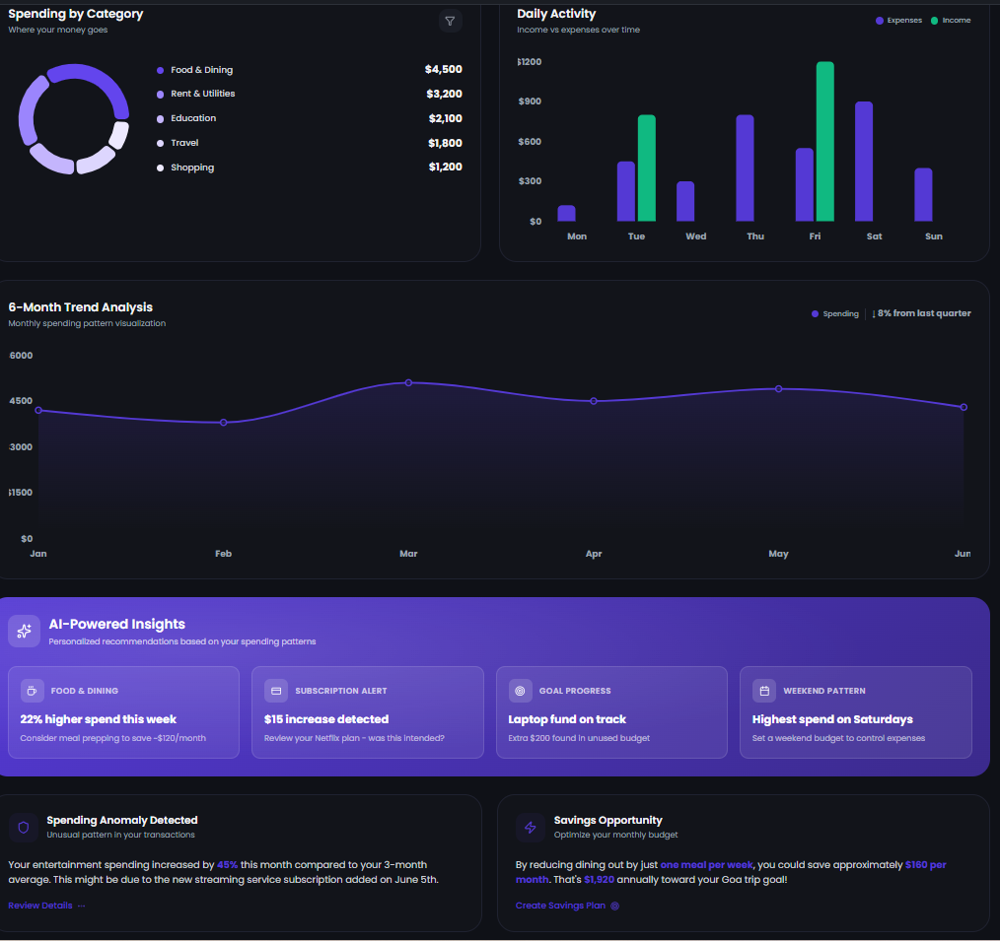

# Budget Buddy 💸

### An Intelligent Financial Dashboard for Students


**Live Demo:** [https://budget-buddy-delta-five.vercel.app/](https://budget-buddy-delta-five.vercel.app/)

##  Overview

**Budget Buddy** is a modern, high-fidelity financial dashboard specifically designed to help students track allowances, monitor daily spending habits, and predict when their money will run out. It transforms complex financial tracking into a simple, visual, and insight-driven experience.

---

##  App Gallery

<div align="center">
  
  
  <br />
  
  
  <br />
  
</div>

---

## The Problem

College students often struggle with:
- Managing limited monthly allowances
- Tracking daily spending habits accurately
- Overspending blindly without recognizing patterns
- Running out of money before the end of the month
- A lack of clarity on where their money is actually going

Most existing consumer finance tools are either too complex (built for budgeting mortgages and investments) or not tailored enough for a student's highly variable month-to-month lifestyle.

---

## The Solution

Budget Buddy solves these problems by providing:
- A crystal-clear overview of current financial status
- Immediate visibility into daily spending velocity
- **Predictive insights** (e.g., how long the current balance will last if spending continues at the current rate)
- Goal tracking for short-term savings (like a road trip or a new laptop)
- Smart suggestions based on real-time spending patterns

---

## Key Features

###  1. Dashboard Overview
The main dashboard serves as the command center, providing a zero-friction summary of the user's financial health:
- **Hero Stats:** Total balance, monthly allowance/income, total expenses, and current savings.
- **Trend Visualization:** A dynamic time-based chart displaying spending trends over the week/month.
- **Category Breakdown:** A beautiful categorical chart illustrating exactly where money is being spent (Food, Travel, Tech, etc.).
- **Recent Activity:** A quick-glance feed of the most recent transactions.

###  2. Transactions Management
A robust ledger for all financial movements:
- View all detailed financial activities.
- **Simple Filtering:** Filter lists by category, transaction type, or date.
- **Search & Sort:** Instantly search for specific merchants or sort by amount/date.
- **Role-Based UI:**
  - *Viewer:* Can browse and analyze data.
  - *Admin:* Granted full control to add, edit, or remove transactions from the ledger.

###  3. Smart Wallet System (Core Interactive Feature)
The Wallet section transcends traditional balance displays by introducing intelligent financial heuristics:
- **Available Balance & Safety:** Calculates a rigid "Safe Daily Spending Limit" to ensure funds last until the end of the month.
- **Survival Prediction:** Estimates exactly how many days the remaining money will last based on current spending velocity.
- **Calendar-Based Spending UI:** A highlight feature that turns a monthly calendar into a financial heatmap. Days are color-coded by spending intensity (low vs. high). Clicking any date instantly opens a detailed receipt for that specific day.
- **Card & Subscriptions Management:** A clean UI to track linked bank cards, active monthly subscriptions, and quick-transfer contacts.

###  4. Goals and Savings Tracking
An interactive module dedicated to helping users plan and realistically achieve short-term financial targets:
- Set customizable goals (e.g., Tech upgrades, trips, emergency funds).
- Visual progress indicators showing exactly how close a goal is to completion.
- Priority-based tracking ensuring the most important goals get funded first.

###  5. Insights Engine
Turns raw numbers into actionable advice:
- Identifies the highest spending category.
- Provides month-over-month comparative analysis.
- Generates overspending alerts and warnings when survival prediction drops dangerously low.

---

##  Role-Based Access Control (UI Simulation)

To demonstrate dynamic UI states, Budget Buddy implements a front-end simulated RBAC system, toggled via the Topbar:
- **Viewer Role:** The interface is locked to Read-Only mode. Add/Edit buttons disappear or are disabled, preventing data mutation.
- **Admin Role:** Full Write access is granted. The user can add new transactions, create new savings goals, and adjust settings.

---

##  Technical Implementation

### Tech Stack
- **Framework:** React 18 with TypeScript
- **Build Tool:** Vite for lightning-fast HMR and optimized builds
- **Styling:** Tailwind CSS v4 for rapid, utility-first UI development
- **Icons:** Lucide React
- **Data Visualization:** Recharts for responsive, animated charting
- **State Management:** React Context API (`AppContext`) for lightweight, efficient global state handling (Dark Mode, RBAC Role, Sidebar state).

### UI/UX Design Approach
- **Modern & Premium Aesthetics:** Utilizes soft gradients, glassmorphism elements, strict spacing scales, and deep shadows to create a high-trust, premium financial environment.
- **Responsive:** The layout adapts flawlessly using CSS Grid, Flexbox, and intelligent container sizing, looking great on desktops and scaling down gracefully.
- **Dark Mode:** A fully deeply-integrated Dark Theme ensures usability in low-light environments, using carefully selected slate and indigo hex tokens.

---

##  Setup Instructions

1. **Clone the repository**
   ```bash
   git clone https://github.com/guru963/Budget-Buddy.git
   cd finance
   ```

2. **Install dependencies**
   Ensure you have Node.js installed, then run:
   ```bash
   npm install
   ```

3. **Start the Development Server**
   ```bash
   npm run dev
   ```

4. **Open your browser**
   Navigate to `http://localhost:5173` to view the application.

---

##  Evaluation Criteria Mapping

- **Design and Creativity:** High-fidelity UI using Tailwind, custom gradients, and a unique Calendar Heatmap for spending.
- **Responsiveness:** Grid-based layouts that adjust to varying viewport widths.
- **Functionality:** Meets all requirements including Dashboards, Transactions, Insights, and Simulated RBAC.
- **Technical Quality:** Built with strict TypeScript, modular React components, and dynamic mock data separated cleanly from presentation logic.
- **State Management:** Uses React Context (`AppContext.tsx`) to lift state cleanly for themes and user roles without prop drilling.

---
*Developed for evaluation purposes.*
